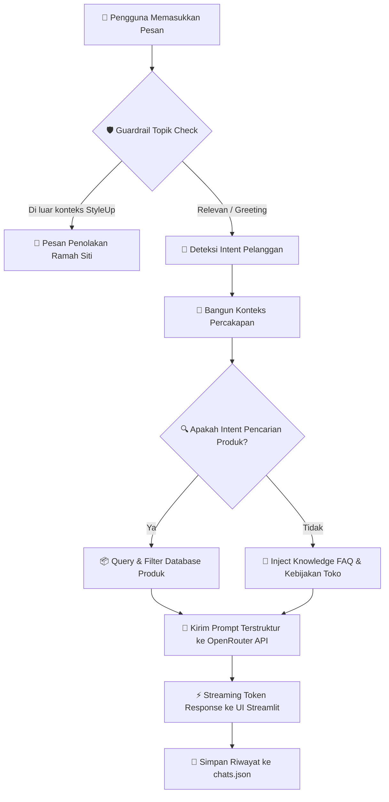

# 🛍️ StyleUp — AI Customer Service Chatbot

<p align="center">
  
</p>

<p align="center">
  <strong>Solusi Asisten Customer Service AI Cerdas, Responsif, dan Terstruktur untuk Toko Fashion Modern</strong>
</p>

<p align="center">
  <a href="https://chatbot-xdpwmm2snbqlywrjzrpq2m.streamlit.app/"></a>
  <a href="https://github.com/Mfirmansyah28/chatbot"></a>
</p>

<p align="center">
  
  
  
  
  
</p>

---

## 📌 Daftar Isi

- [✨ Tentang StyleUp & Siti](#-tentang-styleup--siti)
- [🚀 Fitur Unggulan](#-fitur-unggulan)
- [🏗️ Arsitektur & Cara Kerja](#️-arsitektur--cara-kerja)
- [📦 Katalog Produk & Layanan](#-katalog-produk--layanan)
- [📂 Struktur Proyek](#-struktur-proyek)
- [🛠️ Prasyarat](#️-prasyarat)
- [💻 Panduan Instalasi & Menjalankan](#-panduan-instalasi--menjalankan)
- [⚙️ Konfigurasi Environment](#️-konfigurasi-environment)
- [🧰 Teknologi yang Digunakan](#-teknologi-yang-digunakan)
- [🤝 Kontribusi & Lisensi](#-kontribusi--lisensi)

---

## ✨ Tentang StyleUp & Siti

**StyleUp Chatbot** adalah aplikasi customer service berbasis web cerdas yang dikembangkan menggunakan **Streamlit** dan ditenagai oleh model AI LLM melalui **OpenRouter** (`nvidia/nemotron-3-nano-30b-a3b:free`).

Chatbot ini dirancang dengan persona virtual customer service bernama **"Siti"**:
* 🌸 **Ramah & Sopan**: Selalu menyapa pelanggan dengan panggilan santun (*"Kak / Kakak"*) disertai emoji yang ceria dan relevan.
* 🎯 **Fokus & Anti-Halusinasi**: Dilengkapi sistem guardrail ketat untuk memastikan jawaban hanya bersumber dari katalog dan panduan resmi StyleUp.
* ⚡ **Cepat & Alami**: Menyajikan output dengan streaming token real-time demi pengalaman percakapan interaktif layaknya CS manusia.

---

## 🚀 Fitur Unggulan

| Fitur | Deskripsi |
|---|---|
| 🤖 **Persona CS "Siti"** | Gaya bahasa kasual, ramah, dan profesional khas staf customer service Indonesia. |
| 🧠 **Multi-Turn Context** | Mampu memahami kelanjutan pembicaraan seperti *"yang tadi harganya berapa?"* atau *"ada ukuran XL-nya gak?"* tanpa perlu mengetik ulang konteks. |
| 🔍 **Pencarian Produk Cerdas** | Filter otomatis berdasarkan nama produk, varian warna, kisaran budget / harga, dan ukuran dari katalog. |
| 🛡️ **Dual-Layer Guardrail** | Penyaringan topik di awal (mencegah pertanyaan out-of-topic) dan guardrail prompt instruksi anti-halusinasi untuk model AI. |
| 🎯 **Deteksi Intent Otomatis** | Klasifikasi intent pesan pengguna (pencarian produk, stok, harga, metode pembayaran, pengiriman, retur barang, hingga sapaan). |
| 📁 **Multi-Session Chat Manager** | Manajemen banyak ruang percakapan: buat sesi baru (*New Chat*), beralih antar chat, serta hapus riwayat chat kapan saja. |
| 💾 **Penyimpanan Chat Persisten** | Riwayat obrolan tersimpan rapi dalam format JSON lokal (`data/chats.json`), aman meski halaman di-refresh. |
| ⚡ **Real-Time Streaming** | Efek pengetikan teks secara langsung (token-by-token) untuk respons yang cepat dan interaktif. |
| 📋 **Salin Pesan (Copy to Clipboard)** | Tombol praktis untuk menyalin respons asisten ke clipboard dalam satu klik. |
| 🔒 **Keamanan Kredensial** | Manajemen API Key aman menggunakan `st.secrets` bawaan Streamlit (terisolasi dari publik). |

---

## 🏗️ Arsitektur & Cara Kerja

Alur pemrosesan pesan dirancang dengan pendekatan berlapis (*modular pipeline*) untuk menjamin akurasi dan kecepatan:



---

## 📦 Katalog Produk & Layanan

### 👗 Produk Fashion Unggulan

| No | Nama Produk | Pilihan Warna | Pilihan Ukuran | Harga |
|:---:|:---|:---|:---:|:---:|
| 1 | **Kemeja Flanel Kotak-Kotak** | Merah-Hitam, Biru-Navy | M, L, XL | `Rp 150.000` |
| 2 | **Kaos Polos Katun Premium** | Hitam, Putih, Sage Green, Lilac | S, M, L, XL | `Rp 75.000` |
| 3 | **Celana Chino Slimfit** | Krem, Hitam, Abu-abu | 28, 30, 32, 34 | `Rp 200.000` |

### 🚚 Informasi Layanan & Kebijakan Toko
* 💳 **Metode Pembayaran**: Transfer Bank (BCA, Mandiri, BRI), E-Wallet (GoPay, OVO, Dana), dan COD (Bayar di Tempat).
* 📦 **Pengiriman**: JNE, J&T, SiCepat, dan Gosend/GrabExpress (Jabodetabek).
* 🔄 **Kebijakan Retur**: Garansi penukaran ukuran atau barang cacat maksimal 3 hari setelah barang diterima (disertai video unboxing).

---

## 📂 Struktur Proyek

```plaintext
chatbot/
├── 📁 .streamlit/
│   └── secrets.toml             # Konfigurasi kredensial lokal (OpenRouter API Key)
├── 📁 data/
│   └── chats.json               # Basis data lokal riwayat obrolan multi-sesi
├── 📁 services/
│   ├── catalog.py               # Dataset katalog produk, database FAQ, & prompt sistem Siti
│   ├── chat_manager.py          # Logika CRUD sesi percakapan (simpan, baca, hapus)
│   ├── conversation_context.py  # Resolver konteks multi-turn percakapan sebelumnya
│   ├── guardrail.py             # Layer validasi topik & filter pencegah halusinasi
│   ├── intent.py                # Engine klasifikasi intent pengguna
│   ├── intent_context.py        # Mapping instruksi spesifik berdasarkan intent
│   ├── openrouter.py            # Client komunikasi OpenRouter AI (mode streaming)
│   └── product_search.py        # Algoritma pencarian produk (warna, harga, tipe, filter)
├── 📁 ui/
│   └── sidebar.py               # Komponen antarmuka sidebar riwayat & navigasi chat
├── 📄 app.py                    # Entry point utama aplikasi Streamlit
├── 📄 requirements.txt          # Daftar dependensi paket Python
├── 📄 runtime.txt               # Spesifikasi versi runtime Python untuk deployment
├── 📄 .gitignore                # Pengecualian file sensitif / cache dari git
└── 📄 README.md                 # Dokumentasi lengkap proyek
```

---

## 🛠️ Prasyarat

Sebelum memulai, pastikan perangkat Anda telah terpasang:
* **Python**: Versi `3.10` atau `3.11` (Direkomendasikan `3.11`)
* **Git**: Versi terbaru
* **API Key OpenRouter**: Dapatkan secara gratis di [openrouter.ai](https://openrouter.ai/)

---

## 💻 Panduan Instalasi & Menjalankan

Ikuti langkah-langkah berikut untuk menjalankan proyek di komputer lokal Anda:

### 1️⃣ Clone Repositori
```bash
git clone https://github.com/Mfirmansyah28/chatbot.git
cd chatbot
```

### 2️⃣ Buat dan Aktifkan Virtual Environment

* **Windows (PowerShell / Command Prompt)**:
  ```powershell
  python -m venv venv
  .\venv\Scripts\activate
  ```

* **macOS / Linux**:
  ```bash
  python3 -m venv venv
  source venv/bin/activate
  ```

### 3️⃣ Install Seluruh Dependensi
```bash
pip install --upgrade pip
pip install -r requirements.txt
```

### 4️⃣ Konfigurasi API Key
Buat file baru di `.streamlit/secrets.toml` dan tambahkan kunci OpenRouter Anda:

```toml
OPENROUTER_API_KEY = "sk-or-v1-xxxxxxxxxxxxxxxxxxxxxxxxxxxxxxxx"
```

> [!NOTE]
> File `.streamlit/secrets.toml` telah ditambahkan ke `.gitignore` sehingga API Key Anda tetap aman dan tidak akan terunggah ke repositori publik.

### 5️⃣ Jalankan Aplikasi
```bash
streamlit run app.py
```

Buka peramban (browser) dan akses alamat:  
👉 **`http://localhost:8501`**

---

## 🧰 Teknologi yang Digunakan

<div align="center">

| Komponen | Teknologi / Library | Versi | Peran dalam Sistem |
|:---|:---|:---:|:---|
| **UI Framework** | [Streamlit](https://streamlit.io/) | `1.46.1` | Antarmuka interaktif, layout chat, dan state management |
| **AI LLM Model** | [Nemotron 3 Nano](https://openrouter.ai/models/nvidia/nemotron-3-nano-30b-a3b:free) | `30B-A3B` | Model penalaran dan pembentukan respons ramah |
| **API Provider** | [OpenRouter](https://openrouter.ai/) | `v1` | Gateway penyedia akses model LLM hemat biaya & cepat |
| **API Client** | [OpenAI Python SDK](https://github.com/openai/openai-python) | `1.99.9` | Klien HTTP terstandarisasi untuk streaming response |
| **Penyimpanan** | JSON Flat File | Native | Penyimpanan persisten riwayat percakapan pengguna |
| **Bahasa Pemrograman** | [Python](https://www.python.org/) | `3.11` | Bahasa utama logika backend & pipeline layanan |

</div>

---

## 🌐 Live Demo & Deployment

Aplikasi ini telah dideploy dan dapat diakses langsung secara online:

🔗 **URL Demo**: [https://chatbot-xdpwmm2snbqlywrjzrpq2m.streamlit.app/](https://chatbot-xdpwmm2snbqlywrjzrpq2m.streamlit.app/)

---

## 🤝 Kontribusi & Lisensi

Kontribusi, saran perbaikan, dan ide fitur baru selalu terbuka! Silakan lakukan *Fork* repositori ini, buat *branch* baru, dan ajukan *Pull Request*.

Proyek ini dilisensikan di bawah lisensi **MIT**.

<p align="center">
  Dibuat oleh <strong><a href="https://github.com/Mfirmansyah28">M.Firmansyah</a></strong>
</p>
